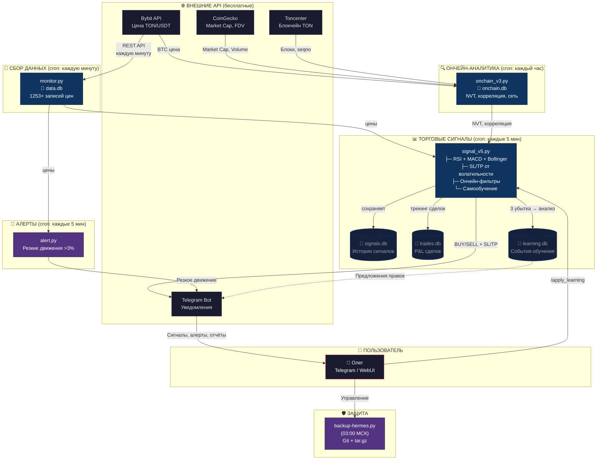

## 📋 Легенда

| Цвет | Компонент | Описание |
|------|-----------|----------|
| 🔵 Тёмный | Внешние API | Бесплатные источники данных |
| 🔷 Синий | Процессы | Python-скрипты, cron-задачи |
| 🔹 Серый | Базы данных | SQLite-хранилища |
| 🟣 Фиолетовый | Защита/Алерты | Бэкапы, уведомления |
| 🔴 Красный | Пользователь | Олег через Telegram/WebUI |
